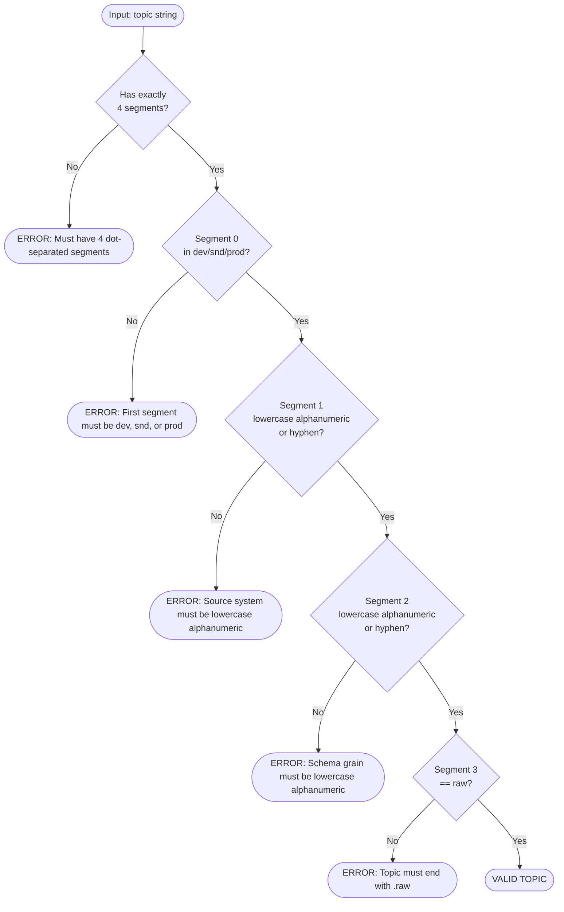
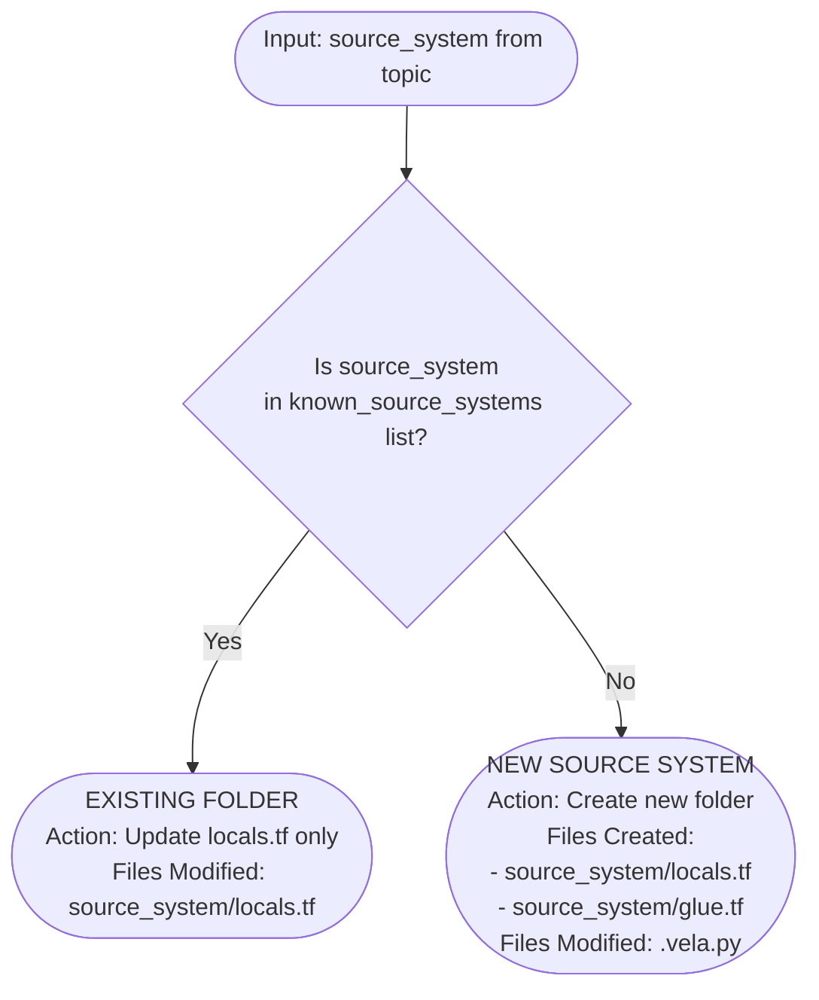
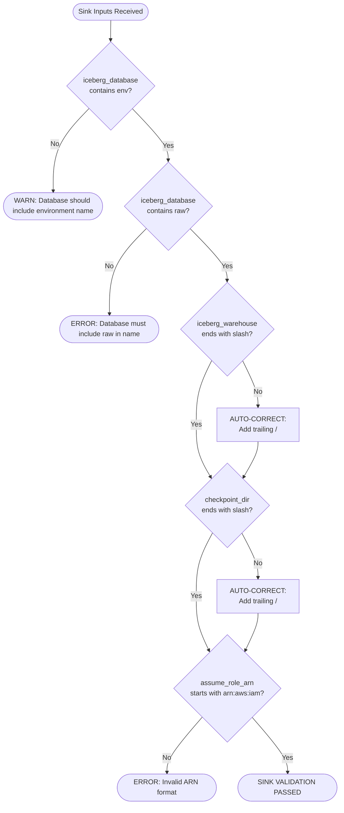
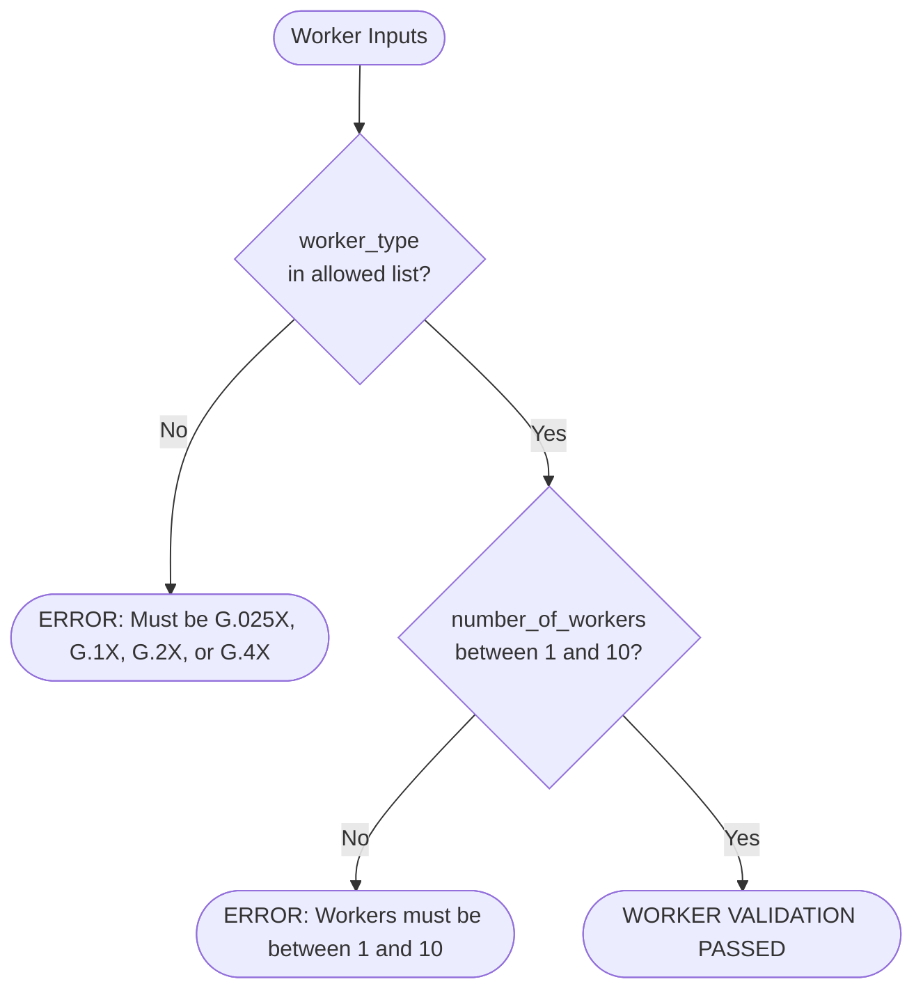

# Glue Job Creation Agent — Decision Trees & Workflows

## 1. Master Workflow: User Request → Terraform Output

```mermaid
flowchart TD
    A([User Request:\nCreate Glue Job]) --> B[Ask for Kafka Topic Name]
    B --> C{Topic Provided?}
    C -->|No| B
    C -->|Yes| D[Validate Topic Pattern\n{env}.{source}.{grain}.raw]
    D --> E{Pattern Valid?}
    E -->|No| F[Show Error + Correct Pattern\nAsk Again]
    F --> B
    E -->|Yes| G[Extract Parts from Topic:\n- env = segment 0\n- source_system = segment 1\n- schema_grain = segment 2]
    G --> H[Derive Auto-Values:\n- job_key\n- kafka_secret_name]
    H --> I{Source System Folder\nAlready Exists?}
    I -->|Yes| J[EXISTING FOLDER PATH\nWill update locals.tf only]
    I -->|No| K[NEW FOLDER PATH\nWill create locals.tf + glue.tf\n+ register in .vela.py]
    J --> L[Show Derived Values\nAsk User Confirmation]
    K --> L
    L --> M{User Confirms\nDerived Values?}
    M -->|No - Corrections Needed| N[Apply Corrections\nRe-show Summary]
    N --> M
    M -->|Yes| O[Ask for Sink Parameters:\n1. iceberg_database\n2. iceberg_warehouse\n3. assume_role_arn\n(checkpoint_dir is auto-derived)]
    O --> P[Validate Sink Inputs]
    P --> Q{Sink Validation\nPassed?}
    Q -->|Fail| R[Show Specific Errors\nAsk to Re-enter Failed Fields]
    R --> P
    Q -->|Pass| S[Ask for Optional Overrides:\nworker_type, workers count,\nscheduling mode]
    S --> T{User Provides\nOverrides?}
    T -->|Yes| U[Validate Overrides]
    T -->|No - Use Defaults| V[Apply Defaults:\nG.1X, 2 workers, Manual]
    U --> W{Override Validation\nPassed?}
    W -->|Fail| X[Show Error\nUse Default or Re-enter]
    X --> S
    W -->|Pass| Y[Show Final Summary Table\nAll Parameters]
    V --> Y
    Y --> Z{User Final\nConfirmation?}
    Z -->|No| AA[Ask What to Change]
    AA --> S
    Z -->|Yes| AB[Generate Terraform Entry\nFill Template]
    AB --> AC{New Folder\nRequired?}
    AC -->|Yes| AD[Generate:\n- locals.tf content\n- glue.tf content\n- .vela.py change note]
    AC -->|No| AE[Generate:\n- locals.tf glue_jobs entry only]
    AD --> AF[Show PR Checklist]
    AE --> AF
    AF --> AG([OUTPUT READY\nTerraform + PR Checklist])
```

---

## 2. Topic Validation Flow



---

## 3. Source System Detection Flow



---

## 4. Sink Validation Flow



---

## 5. Worker Validation Flow



---

## 6. End-to-End Parameter Collection State Machine

```
STATE: IDLE
  → User starts request
  → TRANSITION TO: COLLECTING_TOPIC

STATE: COLLECTING_TOPIC
  → Ask for Kafka topic
  → Receive topic
  → Validate topic
  → If FAIL → Stay in COLLECTING_TOPIC (show error)
  → If PASS → Extract source_system, schema_grain, env
  → TRANSITION TO: CONFIRMING_DERIVED_VALUES

STATE: CONFIRMING_DERIVED_VALUES
  → Show: job_key, kafka_secret_name, source folder decision
  → User confirms or corrects
  → If corrections → Apply → Stay in CONFIRMING_DERIVED_VALUES
  → If confirmed → TRANSITION TO: COLLECTING_SINK_PARAMS

STATE: COLLECTING_SINK_PARAMS
  → Ask for: iceberg_database, iceberg_warehouse, checkpoint_dir, assume_role_arn
  → Validate each field
  → If any FAIL → Show errors → Stay in COLLECTING_SINK_PARAMS
  → If all PASS → TRANSITION TO: COLLECTING_OPTIONAL_PARAMS

STATE: COLLECTING_OPTIONAL_PARAMS
  → Show defaults
  → Ask if user wants to override
  → If no → Use defaults → TRANSITION TO: FINAL_CONFIRMATION
  → If yes → Collect overrides → Validate → TRANSITION TO: FINAL_CONFIRMATION

STATE: FINAL_CONFIRMATION
  → Show complete parameter summary table
  → Ask user to confirm
  → If no → Ask what to change → TRANSITION TO: appropriate state
  → If yes → TRANSITION TO: GENERATING_OUTPUT

STATE: GENERATING_OUTPUT
  → Fill Terraform template with all values
  → Determine folder creation vs update
  → Generate output files list
  → Generate PR checklist
  → TRANSITION TO: OUTPUT_READY

STATE: OUTPUT_READY
  → Present Terraform entry
  → Present PR checklist
  → End
```

---

## 7. Auto-Derivation Rules

| Input | Auto-Derived Output | Formula |
|---|---|---|
| `dev.saptcc.multi-1.raw` | `source_system = saptcc` | `topic.split('.')[1]` |
| `dev.saptcc.multi-1.raw` | `schema_grain = multi-1` | `topic.split('.')[2]` |
| `dev.saptcc.multi-1.raw` | `env = dev` | `topic.split('.')[0]` |
| `source_system=saptcc, grain=multi-1` | `job_key = kafka-to-iceberg-batch-saptcc-multi-1` | `f'kafka-to-iceberg-batch-{source_system}-{schema_grain}'` |
| `env=dev, source_system=saptcc` | `kafka_secret_name = minerva-dev-corp-mif-saptcc-gluejob-sa-cc-api-creds` | `f'minerva-{env}-corp-mif-{source_system}-gluejob-sa-cc-api-creds'` |
| `source_system=saptcc` | `folder_check = saptcc/` | Check against known_source_systems list |

---

## 8. Sample Conversation

### Scenario: Add job to existing source system (saptcc)

```
User:  I need to create a Glue job for dev.saptcc.cdhdr.raw

Agent: From topic dev.saptcc.cdhdr.raw I derived:
       - Environment     : dev
       - Source System   : saptcc
       - Schema Grain    : cdhdr
       - Job Name        : kafka-to-iceberg-batch-saptcc-cdhdr
       - Kafka Secret    : minerva-dev-corp-mif-saptcc-gluejob-sa-cc-api-creds
       - Source Folder   : saptcc/ (EXISTING — will update locals.tf only)
       Is this correct?

User:  Yes

Agent: I need 4 more values for the Iceberg sink:
       1. Target database name  (e.g. minerva_dev_src_agtr_saptcc_prd_raw_db)
       2. S3 warehouse path     (must end with /)
       3. S3 checkpoint path    (must end with /)
       4. Assume Role ARN       (arn:aws:iam::...)

User:  1. minerva_dev_src_agtr_saptcc_prd_raw_db
       2. s3://minerva-dev-src-agtr/current/prd/raw/saptcc/
       3. s3://minerva-dev-glue-checkpoints/checkpoints/unified/
       4. arn:aws:iam::123456789012:role/mif-dev-iceberg-role

Agent: Validation Results:
       ✅ Database: contains env (dev) and raw — PASS
       ✅ Warehouse path: ends with / — PASS
       ✅ Checkpoint path: ends with / — PASS
       ✅ ARN format: valid — PASS

       Using defaults:
       - Worker Type    : G.1X
       - Workers        : 2
       - Scheduling     : Manual

       Do you want to change any of these?

User:  Use G.2X and 4 workers

Agent: ✅ G.2X is valid
       ✅ 4 workers is within range (1-10)

       Final Summary:
       ┌─────────────────────┬─────────────────────────────────────────────┐
       │ Topic               │ dev.saptcc.cdhdr.raw                        │
       │ Job Name            │ kafka-to-iceberg-batch-saptcc-cdhdr         │
       │ Source System       │ saptcc (existing folder)                    │
       │ Worker Type         │ G.2X                                        │
       │ Workers             │ 4                                           │
       │ Scheduling          │ Manual                                      │
       │ Iceberg Database    │ minerva_dev_src_agtr_saptcc_prd_raw_db      │
       │ Action              │ Update saptcc/locals.tf                     │
       └─────────────────────┴─────────────────────────────────────────────┘

       Proceed? (yes/no)

User:  yes

Agent: [Generates complete Terraform entry + PR checklist]
```

### Scenario: New source system (newapp)

```
User:  Create a Glue job for dev.newapp.events.raw

Agent: From topic dev.newapp.events.raw I derived:
       - Source System   : newapp
       - Source Folder   : newapp/ ⚠️ NEW SOURCE SYSTEM — Folder does not exist yet
       
       This will require creating:
         - newapp/locals.tf  (new file)
         - newapp/glue.tf    (new file)
         And registering newapp/ in .vela.py
       
       I also need: ent_func and subgroup for the new folder.
       Allowed ent_func values: AGTR, CORP, FOOD, SPEC
       Which ent_func applies to newapp?
```
