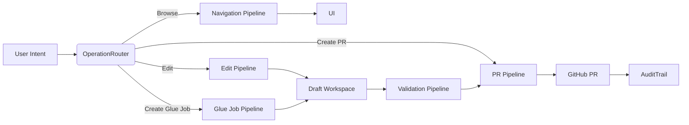
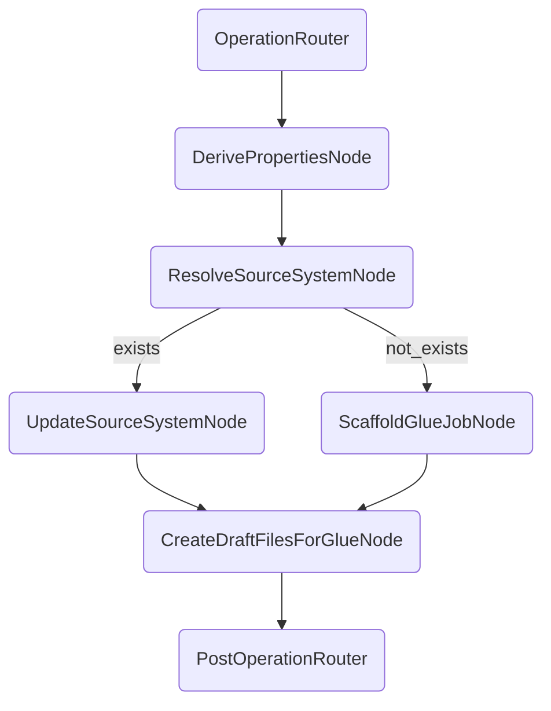
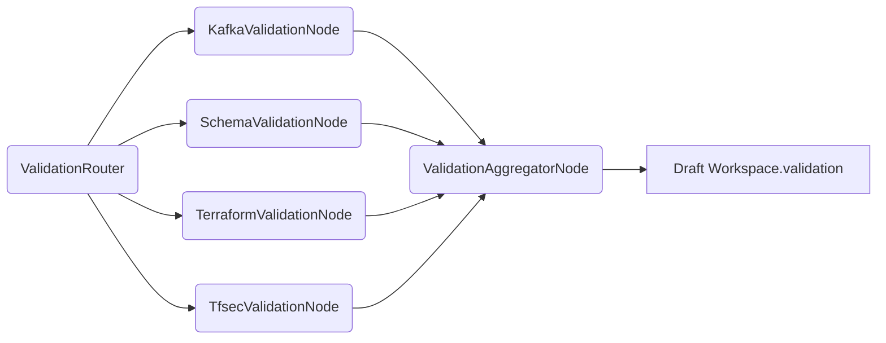
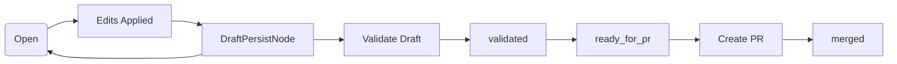
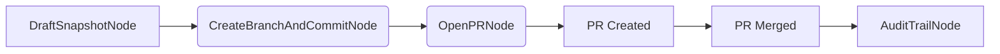

**LangGraph V2 — Architecture Specification**

Purpose
-------
- Provide a production-ready LangGraph architecture specification for the MIF Infrastructure Copilot that implements Draft-First editing, Glue Job creation (new and existing source systems), repository navigation, validation, PR lifecycle, session restore, and human approval flows.
- This document is implementation-facing: it maps graph topology to node responsibilities, routing rules, state transitions, and integration points with `STATE_MODEL_V2`, the Draft Workspace, the repository navigator, and validators.

Design Constraints & Business Rules (Summary)
--------------------------------------------
- One node = one responsibility. Nodes are stateless; all session data persists only in `STATE_MODEL_V2` and the Draft Workspace.
- Draft Workspace is the canonical working object; no direct repo commits until PR creation.
- When the user creates a Glue Job for an existing source system (e.g., `saptcc/` exists with `locals.tf` and `glue.tf`), the graph MUST modify existing files under that folder (update `saptcc/locals.tf`, not create a new `saptcc_v2/` folder).
- If the source system does not exist, create a new `<source_system>/locals.tf` and `<source_system>/glue.tf` and required resources in Draft Workspace.
- Never ask derivable questions (e.g., "How many Glue Jobs?"). Always ask only: "What would you like to do next?" after each operation.
- Validation runs exactly once for the full Draft Workspace before PR creation: Kafka, Schema, Terraform, tfsec.

Overview — High-Level Graph
---------------------------
- The LangGraph is organized as layered pipelines connected by router nodes. Each pipeline is composed of stateless worker nodes and idempotent helper nodes. Session orchestration is driven by a small set of router and policy nodes that read/write `STATE_MODEL_V2` and the Draft Workspace.

Core Components
---------------
- Router nodes: `OperationRouter`, `ValidationRouter`, `PRRouter`, `NavigationRouter` — these decide the next node(s) to invoke based on `NavigatorState` and `DraftWorkspace`.
- Action nodes: single-responsibility nodes that perform transformations or calls (e.g., `DerivePropertiesNode`, `ScaffoldGlueJobNode`, `UpdateSourceSystemNode`, `CreateDraftFileNode`, `ListRelatedFilesNode`, `RunTerraformPlanNode`).
- Helper nodes: `DerivationLoggerNode`, `AuditTrailNode`, `ValidationAggregatorNode`, `DraftPersistNode`.
- External integrators: nodes that call external services (GitHub, Terraform, tfsec, Kafka, Schema Registry) — always write results back into `DraftWorkspace.validation` or `STATE_MODEL_V2`.

Complete Graph Architecture
---------------------------
- Entry point nodes:
  - `SessionInitNode` — restores `NavigatorState` and `DraftWorkspace` from storage when a session resumes or starts; sets `sessionId`.
  - `OperationRouter` — receives explicit user operation intent (Create Glue Job | Modify Existing Files | Review Draft Workspace | Create Pull Request) and routes to the appropriate pipeline.
- Pipelines (high level):
  - Navigation Pipeline — `NavigationRouter` → `ListFoldersNode` → `ListFilesNode` → `PreviewFileNode` → `ListRelatedFilesNode` → UI.
  - Edit Pipeline — `OpenEditorNode` → `CreateDraftFileNode` → `DraftPersistNode` → `PostOperationRouter`.
  - Glue Job Creation Pipeline — `DerivePropertiesNode` → `ScaffoldGlueJobNode` → `CreateDraftFilesForGlueNode` → `RelatedFileIndexerNode` → `DraftPersistNode` → `PostOperationRouter`.
  - Existing Source System Update Pipeline — `ResolveSourceSystemNode` → `UpdateSourceSystemNode` → `DraftPersistNode` → `RelatedFileIndexerNode` → `PostOperationRouter`.
  - Validation Pipeline — `ValidationRouter` → parallel nodes: `KafkaValidationNode`, `SchemaValidationNode`, `TerraformValidationNode`, `TfsecValidationNode` → `ValidationAggregatorNode` → attach `ValidationReport` to Draft Workspace.
  - PR Pipeline — `PRRouter` → `DraftSnapshotNode` → `CreateBranchAndCommitNode` → `OpenPRNode` → `AuditTrailNode`.
  - Session Restore Pipeline — `SessionInitNode` → `StateHydratorNode` → UI restore.

Node Hierarchy & Responsibilities
---------------------------------
- `SessionInitNode` — load persisted `NavigatorState` + `DraftWorkspace` from storage. Validate session integrity (auth, repo pointer). Output hydrated state.
- `OperationRouter` — read user's explicit command and `NavigatorState.lastOperation`; route to appropriate pipeline. Minimal logic: deterministic switch.
- `NavigationRouter` — decide whether to call `ListFoldersNode` or `ListFilesNode` based on `cursor`.
- `ListFoldersNode` / `ListFilesNode` — repository-indexing read-only nodes that use repository search heuristics and knowledge base to enumerate results.
- `PreviewFileNode` — render file preview (HCL, JSON, Markdown) and compute initial `RelatedFilesSummary` using `ListRelatedFilesNode`.
- `ListRelatedFilesNode` — implement heuristics in `REPOSITORY_NAVIGATOR.md` (path neighbors, name matching, module refs, variable usage, secrets, glue manifests, validation rules). Returns `RelatedFilesSummary[]` and writes to `NavigatorState.relatedIndex`.
- `OpenEditorNode` — prepares editor context with draft overlay; reads base file content and any existing `DraftFile` override.
- `CreateDraftFileNode` — create/update a `DraftFile` entry in the Draft Workspace; record `originalHash`, `changeType`, and `derivedFrom` if applicable.
- `DraftPersistNode` — persist the Draft Workspace incremental changes to durable store. Also triggers `DerivationLoggerNode` and `AuditTrailNode` for provenance entries.
- `DerivePropertiesNode` — call Derivation Engine to produce `DerivationEntry[]` for required properties. Stores results to `STATE_MODEL_V2.derivedValues` and selects values with confidence >= threshold.
- `ScaffoldGlueJobNode` — generate Glue Job scaffolding files (job JSON, terraform snippets, IAM snippets) based on derived properties. Produces `DraftFile[]` and `GlueJobSummary` entries.
- `ResolveSourceSystemNode` — check repository for existing `<source_system>/` folder; if exists, returns `exists=true` with list of files and target filepaths to modify; otherwise returns `exists=false` and a recommended scaffolding plan.
- `UpdateSourceSystemNode` — if `exists=true`, compute edits (e.g., modify `locals.tf`, append to `glue.tf`) and create `DraftFile` modifications rather than new folder creation.
- `CreateDraftFilesForGlueNode` — translate scaffold into DraftFiles and attach `GlueJobSummary` to Draft Workspace.
- `RelatedFileIndexerNode` — update `NavigatorState.relatedIndex` for newly created or modified files.
- `ValidationRouter` — when validation is invoked, route to the validator nodes in parallel and collect results.
- `KafkaValidationNode`, `SchemaValidationNode`, `TerraformValidationNode`, `TfsecValidationNode` — run checks against Draft Workspace (work on the draft files; never on main branch); each returns findings mapped to file paths.
- `ValidationAggregatorNode` — normalize findings, compute severity, and attach `ValidationReport` to Draft Workspace.
- `DraftSnapshotNode` — prepare canonical snapshot of the Draft Workspace for commit (single branch snapshot). Includes derivation provenance and validation report.
- `CreateBranchAndCommitNode` — create branch in the fork/repo, commit snapshot files to branch (no merges), return branchRef.
- `OpenPRNode` — open PR with validation report and derivation provenance. Must prompt exactly once: "Create Pull Request?" and wait for user confirmation.
- `AuditTrailNode` — append session-level audit records to `logs/audit.jsonl` including `DerivationEntry` ids, node actions, user approvals.

Routing Logic
-------------
- Routers use a combination of `NavigatorState.cursor`, `lastOperation`, `draftWorkspace.status`, and user intent to make deterministic routing decisions.
- Example: `OperationRouter` receives `create_glue_job` -> call `DerivePropertiesNode` -> call `ResolveSourceSystemNode` -> branch: if exists -> `UpdateSourceSystemNode` else -> `ScaffoldGlueJobNode`.
- All nodes return structured responses `{ status, outputs, next }` and never mutate session state directly; state mutations are done by `DraftPersistNode` and `StateWriter` helper nodes.

State Transitions (Draft Workspace & NavigatorState)
--------------------------------------------------
- DraftWorkspace.status transitions:
  - `open` (initial) → after edits remain `open`
  - `validated` (after `ValidationAggregatorNode` success)
  - `ready_for_pr` (after user confirms PR creation)
  - `merged` (after PR merged)
  - `abandoned` (user or system abort)
- NavigatorState.cursor changes as users navigate folders/files; `relatedIndex` is updated by `RelatedFileIndexerNode` when files are selected/created.

Draft Workspace Integration
---------------------------
- All file outputs from graph nodes must be persisted as `DraftFile` objects and written to Draft Workspace via `DraftPersistNode`.
- Draft Workspace acts as the single input for validations, the PR snapshot, and session restore.

Validation Pipeline
-------------------
- `ValidationRouter` invokes validator nodes in parallel.
- Validator nodes operate on the Draft Workspace snapshot (not on repo) and return findings mapped to `DraftFile.path`.
- `ValidationAggregatorNode` performs severity aggregation and optionally suggests quick-fix DraftFiles (which are created as additional DraftFiles and presented to the user for acceptance).

Repository Navigation Pipeline
-----------------------------
- Navigation is read-only until `CreateDraftFileNode` is called.
- `ListRelatedFilesNode` is a core step for every file selection and populates `NavigatorState.relatedIndex` using heuristics described in `docs/REPOSITORY_NAVIGATOR.md`.

Glue Job Creation Pipeline (Summary)
------------------------------------
1. User intent -> `DerivePropertiesNode` (populate properties via KB + repo) -> `ResolveSourceSystemNode`.
2. If source system exists: `UpdateSourceSystemNode` modifies `locals.tf`, `glue.tf`, and linked files in Draft Workspace.
3. If not: `ScaffoldGlueJobNode` creates `<source_system>/locals.tf`, `<source_system>/glue.tf`, and supporting modules.
4. `CreateDraftFilesForGlueNode` persists DraftFiles and registers `GlueJobSummary`.
5. `RelatedFileIndexerNode` links related files. `PostOperationRouter` asks: "What would you like to do next?"

Existing Source System Update Pipeline
-------------------------------------
- `ResolveSourceSystemNode` returns a mapping of target files to be updated (e.g., `saptcc/locals.tf`), plus suggested insert locations based on HCL AST analysis.
- `UpdateSourceSystemNode` produces minimal, targeted edits (append variable values, update locals) as DraftFiles. The graph must NOT create a new `saptcc/` folder.

Session Restore Pipeline
------------------------
- `SessionInitNode` locates a `NavigatorState` and `DraftWorkspace` by `sessionId` and `userId`.
- `StateHydratorNode` loads derived values, relatedIndex, and editor cursor; the UI is restored to the previous view.

PR Creation Pipeline
--------------------
1. User chooses `Create Pull Request` → `OperationRouter` routes to `PRRouter`.
2. `DraftSnapshotNode` composes full snapshot including `DerivationEntry` provenance and `ValidationReport`.
3. Agent prompts user once: "Create Pull Request?". If confirmed: `CreateBranchAndCommitNode` and `OpenPRNode` execute. If not confirmed, return to `PostOperationRouter`.

Error Handling Pipeline
-----------------------
- Nodes return structured errors. Critical errors (auth, storage) bubble to `SessionInitNode` and halt operations.
- Non-fatal errors (validation failures, derivation low-confidence) are persisted to `DraftWorkspace.validation` and surfaced to the user with recommended actions.
- All errors recorded by `AuditTrailNode` with node name, inputs, and truncated outputs.

Human Approval Pipeline
-----------------------
- Any auto-applied changes produced by the graph (e.g., quick-fix DraftFiles from validators) must be presented for user approval before PR creation.
- The graph records approvals as events in `STATE_MODEL_V2.auditRecords` and includes those in the PR description.

Diagrams
--------
End-to-end workflow (high-level)

Node routing (decision example)

Validation routing

Draft Workspace lifecycle

PR lifecycle

Operational Notes & Implementation Guidance
-----------------------------------------
- Keep nodes idempotent and stateless. Persist all state changes via `DraftPersistNode` and `StateWriter` utilities.
- Use HCL AST parsing for accurate `UpdateSourceSystemNode` edits (avoid string append unless safe).
- Maintain derivation provenance for each derived value and include provenance references in the PR body.
- Validation must run against the Draft Workspace snapshot; never against the repo main branch.
- Rate-limit expensive operations (tf plan, tfsec) and cache results by `DraftWorkspace.id` + checksum to avoid repeated runs.

References
----------
- State model: [docs/STATE_MODEL_V2.md](docs/STATE_MODEL_V2.md)
- Repository navigator: [docs/REPOSITORY_NAVIGATOR.md](docs/REPOSITORY_NAVIGATOR.md)
- Auto-derivation rules: [docs/AUTO_DERIVATION_RULES.md](docs/AUTO_DERIVATION_RULES.md)

Document History
----------------
- v1.0 — Initial LangGraph V2 architecture specification.
**LangGraph V2 Architecture Specification**

Overview
--------
- Purpose: Define a production-ready, implementation-facing LangGraph architecture for the Infrastructure Copilot. The graph orchestrates one-responsibility, stateless nodes; session state is stored exclusively in `STATE_MODEL_V2` (docs/STATE_MODEL_V2.md). The Draft Workspace is the central working object and all writes go to it first.
- Scope: complete graph architecture, node hierarchy, responsibilities, routing logic, state transitions, Draft Workspace integration, validation & repository navigation pipelines, Glue Job creation (new and existing sources), session restore, PR lifecycle, error handling, and human approval.

Design Constraints & Business Rules
---------------------------------
- Draft-First: All modifications are saved only into the Draft Workspace. No direct commits to repo.
- Existing Source System Flow: If a source-system folder exists (e.g., `saptcc/`), update existing files (e.g., modify `saptcc/locals.tf`, `saptcc/glue.tf`) rather than creating a new folder.
- New Source System Flow: If not exists, create `<source_system>/locals.tf`, `<source_system>/glue.tf`, and required Terraform resources under the Draft Workspace.
- Never Ask: No quantity prompts or repeated confirmations for derivable values. Only ask targeted clarifying questions when derivation fails.
- Single Validation Gate: Validation runs once across entire Draft Workspace (Kafka, Schema, Terraform, tfsec).
- PR Confirmation: Single final confirmation prompt before PR creation: "Create Pull Request?"
- LangGraph Node Rules: One node = one responsibility; nodes are stateless; session persisted in STATE_MODEL_V2; nodes communicate via typed messages.

Graph Architecture (High-level)
-------------------------------
Top-level stages and responsible orchestration:

- Ingress Layer
  - `UserIntentRouterNode` — maps user intent to high-level operation (modify_file, create_glue_job, review_draft, validate, create_pr)
  - `AuthContextNode` — ensures GitHub OAuth, permissions, and environment context are available and stored in `NavigatorState` portion of `STATE_MODEL_V2`.

- Navigation & Discovery Layer
  - `RepositoryNavigatorNode` — lists source systems, folders, files; updates `NavigatorState.cursor`.
  - `RelatedFileDiscoveryNode` — runs heuristics to attach `RelatedFilesSummary` to selected files.
  - `DerivationEngineNode` — executes AUTO_DERIVATION_RULES and returns `DerivationEntry[]` with confidence/provenance.

- Draft Workspace Layer
  - `DraftWorkspaceManagerNode` — creates/loads Draft Workspace, merges DraftFile changes, enforces save semantics.
  - `DraftFileEditorNode` — accepts edit payloads, records `changeHistory`, computes diffs, and stores content in Draft Workspace.

- Glue Job Pipeline
  - `GlueJobPlannerNode` — accepts a create_glue_job intent, invokes `DerivationEngineNode`, computes job scaffold plan (files + variables).
  - `GlueJobScaffoldNode` — creates `DraftFile` entries for job artifacts. If source-system exists, routes to `ExistingSourceSystemUpdaterNode` otherwise to `NewSourceSystemCreatorNode`.
  - `ExistingSourceSystemUpdaterNode` — merges required edits into existing files (e.g., modify `locals.tf`), marks changeType=modify.
  - `NewSourceSystemCreatorNode` — creates new folder and initial files under Draft Workspace.

- Validation Layer
  - `ValidationOrchestratorNode` — coordinates running validators once across the Draft Workspace (Kafka, Schema, Terraform, tfsec). Aggregates `ValidationReport`.
  - `TerraformValidatorNode` — runs terraform init/plan (on Draft Workspace), captures diffs and plan output.
  - `TfsecValidatorNode` — runs tfsec and returns findings.
  - `KafkaValidatorNode` — checks Kafka topics and cluster state.
  - `SchemaValidatorNode` — validates schema registries and job schemas.

- PR & Commit Layer
  - `PRPackagerNode` — composes branch + commit from Draft Workspace and attaches `ValidationReport` + derivation provenance.
  - `PRCreatorNode` — opens the PR in GitHub; records PRRecord in `STATE_MODEL_V2`.

- Human Interaction & Approval
  - `HumanPromptNode` — only used for required clarifications or final PR confirmation. Must present minimal, context-rich prompts.
  - `ApprovalRecorderNode` — records user approvals in Draft Workspace audit trail.

- Ancillary Nodes
  - `ErrorHandlerNode` — canonical error normalization and retry rules.
  - `SessionRestoreNode` — on resume, rehydrates `NavigatorState` and `DraftWorkspace`.

Node Hierarchy & Responsibilities
---------------------------------
Each node is described with inputs, outputs, responsibilities, and failure modes.

- `UserIntentRouterNode`
  - Responsibility: classify user intent, enrich message with session and environment context.
  - Inputs: user message, sessionId
  - Outputs: routed intent message to specific node
  - Failure: falls back to asking a single targeted question or suggest possible intents.

- `AuthContextNode`
  - Responsibility: validate GitHub OAuth, ensure write permissions and environment selected.
  - Inputs: sessionId, user credentials
  - Outputs: updated `NavigatorState.gitContext`
  - Failure: return readable error guiding OAuth re-auth.

- `RepositoryNavigatorNode`
  - Responsibility: expose source systems, folders, files; return previews.
  - Inputs: `NavigatorState.cursor`, sourceSystem
  - Outputs: file listings, previews, and `RelatedFilesSummary` candidates

- `RelatedFileDiscoveryNode`
  - Responsibility: run discovery heuristics and produce `RelatedFilesSummary`.
  - Inputs: selected file path, repository index
  - Outputs: `RelatedFilesSummary[]` attached to `NavigatorState`

- `DerivationEngineNode`
  - Responsibility: run AUTO_DERIVATION_RULES against KB + repo and produce `DerivationEntry[]`.
  - Inputs: required property list, repository context, KB
  - Outputs: Derivation entries with `value`, `confidence`, `provenance`
  - Failure: low-confidence entries flagged for HumanPromptNode

- `DraftWorkspaceManagerNode`
  - Responsibility: create/load/update Draft Workspace; ensure atomic save semantics.
  - Inputs: sessionId, DraftFile payloads
  - Outputs: updated DraftWorkspace snapshot
  - Failure: storage errors — surface retryable error to ErrorHandlerNode

- `DraftFileEditorNode`
  - Responsibility: apply file edits, compute diffs, maintain `changeHistory`.
  - Inputs: editor payloads, file path, draftWorkspaceId
  - Outputs: updated DraftFile in DraftWorkspace

- `GlueJobPlannerNode`
  - Responsibility: orchestrate derivations and plan job files; ensure no prompts for quantities.
  - Inputs: create_glue_job intent, selected sourceSystem, KB
  - Outputs: scaffold plan (file templates + variable map)
  - Failure: insufficient derivation — route to HumanPromptNode for minimal missing properties

- `GlueJobScaffoldNode`
  - Responsibility: materialize scaffold plan as `DraftFile` entries and link to DraftWorkspace.
  - Inputs: scaffold plan, draftWorkspaceId
  - Outputs: list of created DraftFiles and summary

- `ExistingSourceSystemUpdaterNode`
  - Responsibility: merge new job configuration into existing source-system files (e.g., `locals.tf`, `glue.tf`).
  - Inputs: target sourceSystem path, scaffold changes
  - Outputs: DraftFile modifications flagged as `modify`
  - Failure: conflicting local patterns — surface to DraftFileEditorNode for manual merge

- `NewSourceSystemCreatorNode`
  - Responsibility: create a new source-system folder and standard files.
  - Inputs: sourceSystem id, scaffold plan
  - Outputs: created DraftFile entries flagged as `add`

- `ValidationOrchestratorNode`
  - Responsibility: run validations once across the Draft Workspace, aggregate reports.
  - Inputs: draftWorkspaceId
  - Outputs: ValidationReport attached to DraftWorkspace
  - Failure: runtime validator errors — aggregated as findings and not blocking unless configured

- `TerraformValidatorNode`, `TfsecValidatorNode`, `KafkaValidatorNode`, `SchemaValidatorNode`
  - Responsibility: specialized validations, return structured findings tied to DraftFiles

- `PRPackagerNode` & `PRCreatorNode`
  - Responsibility: package Draft into branch+commit and open PR. Attach validation report and derivation provenance.
  - Inputs: draftWorkspaceId, user approval signal
  - Outputs: PRRecord in `STATE_MODEL_V2`

- `SessionRestoreNode`
  - Responsibility: restore NavigatorState and DraftWorkspace for `sessionId`.

- `ErrorHandlerNode`
  - Responsibility: normalize errors and decide retry/backoff or escalate to HumanPromptNode.

Message Routing & Type System
----------------------------
- Message Envelope (basic fields):
  - `messageId`, `sessionId`, `timestamp`, `type`, `payload`, `trace` (node path)
- Typed payloads: IntentMessage, FileEditMessage, DraftWorkspaceSnapshot, ValidationReport, PRRecord, DerivationRequest/Response.
- Routing rules:
  - UserIntentRouterNode routes by `intent.type`.
  - GlueJobPlannerNode routes to ExistingSourceSystemUpdaterNode or NewSourceSystemCreatorNode based on a repository existence check (RepositoryNavigatorNode result).
  - DraftWorkspace writes always go to DraftWorkspaceManagerNode.

State Transitions
-----------------
State is only mutated through STATE_MODEL_V2 canonical operations. Nodes should never store session state locally.

- Typical transitions:
  1. `NavigatorState.cursor` updated on file navigation.
  2. `DraftWorkspace` initially `open` → after validate → `validated` → after PR creation → `ready_for_pr` → after merge → `merged`.
  3. `derivedValues` appended when DerivationEngineNode returns values.
  4. `validation` replaced with latest `ValidationReport` after ValidationOrchestratorNode runs.

Draft Workspace Integration
--------------------------
- All file edits, scaffolds, and merges are materialized as `DraftFile` objects in the Draft Workspace. DraftWorkspaceManagerNode exposes operations: createDraft, loadDraft, addOrUpdateFile, removeFile, listFiles, snapshot, and finalizeForPR.

Validation Pipeline
-------------------
- Single-run orchestrated pipeline executed by `ValidationOrchestratorNode`:
  1. Populate validator inputs from DraftWorkspace snapshot.
  2. Run `TerraformValidatorNode` (terraform init/plan) and capture plan/diffs.
  3. Run `TfsecValidatorNode` and capture security findings.
  4. Run `KafkaValidatorNode` and `SchemaValidatorNode` for runtime/contract checks.
  5. Aggregate findings into a `ValidationReport` and attach to DraftWorkspace.

Repository Navigation Pipeline
----------------------------
- `RepositoryNavigatorNode` performs a repository index scan (cached) and exposes folder/file listings. It populates `NavigatorState.cursor` and triggers `RelatedFileDiscoveryNode` when file selected.

Glue Job Creation Pipelines
---------------------------
- Existing Source System Update
  1. `GlueJobPlannerNode` computes scaffold plan.
  2. `RepositoryNavigatorNode` confirms sourceSystem path exists.
  3. `GlueJobScaffoldNode` creates a transient plan.
  4. `ExistingSourceSystemUpdaterNode` merges required changes into existing files in Draft Workspace (modify `locals.tf`, `glue.tf`, etc.).
  5. `DraftWorkspaceManagerNode` persists changes.

- New Source System Creation
  1. `GlueJobPlannerNode` computes scaffold plan.
  2. `RepositoryNavigatorNode` confirms sourceSystem path does not exist.
  3. `NewSourceSystemCreatorNode` creates folder and initial files as DraftFiles.
  4. `DraftWorkspaceManagerNode` persists changes.

Session Restore Pipeline
-----------------------
- `SessionRestoreNode` loads `NavigatorState` and associated DraftWorkspace by `sessionId`. It rehydrates UI cursor, derivedValues, and relatedIndex. If the remote repo changed, it sets `rebaseRequired=true` in NavigatorState.

PR Creation Pipeline
--------------------
- 1. User selects `Create Pull Request` and confirms final prompt.
- 2. `PRPackagerNode` snapshots DraftWorkspace and prepares branch/commit.
- 3. `PRCreatorNode` creates branch, commits files, opens PR, and writes `PRRecord` to STATE_MODEL_V2.

Error Handling Pipeline
-----------------------
- `ErrorHandlerNode` receives normalized errors and applies rules:
  - transient I/O → retry with backoff
  - derivation low-confidence → route to HumanPromptNode
  - validation fatal → stop PR creation; mark DraftWorkspace as `validated` with blocker findings

Human Approval Pipeline
-----------------------
- All human interactions are funneled via `HumanPromptNode` with concise, single-topic prompts. Approvals are recorded by `ApprovalRecorderNode` and appended to DraftWorkspace audit trail.

Diagrams (conceptual)
---------------------
- End-to-end workflow: UserIntentRouterNode → Draft Workspace Layer → Glue Job Pipeline / Modify File flow → ValidationOrchestratorNode → PRPackagerNode → PRCreatorNode → merge.
- Node routing: show directed graph where DerivationEngineNode feeds GlueJobPlannerNode; RepositoryNavigatorNode informs ExistingSourceSystemUpdaterNode vs NewSourceSystemCreatorNode.
- Validation routing: DraftWorkspace snapshot → ValidationOrchestratorNode → Terraform/Tfsec/Kafka/Schema nodes → aggregate report.
- Draft Workspace lifecycle: open → edits → snapshot → validate → ready_for_pr → created_pr → merged/abandoned.
- PR lifecycle: Draft snapshot → branch/commit → PR open → review → merge → post-merge cleanup.

Operational Considerations
--------------------------
- Performance: cache repository index and derivations; validate on snapshot to minimize repeated expensive runs.
- Security: never log secrets; derivation provenance must redact sensitive sources.
- Auditability: persist `changeHistory`, derivation provenance, validation reports, and approvals for compliance.

Appendix: Example Message Flows
------------------------------
- Create Glue Job for existing `saptcc`:
  1. UserIntentRouterNode → GlueJobPlannerNode
  2. DerivationEngineNode returns names and values
  3. RepositoryNavigatorNode confirms `saptcc/` exists
  4. GlueJobScaffoldNode produces scaffold
  5. ExistingSourceSystemUpdaterNode merges edits into `saptcc/locals.tf` and `saptcc/glue.tf` as DraftFiles
  6. DraftWorkspaceManagerNode persists and returns summary
  7. Agent: "Created glue job draft `<jobName>`. Saved to draft workspace. What would you like to do next?"

Document History
----------------
- v1.0 — LangGraph V2 architecture produced for implementation.

See also
--------
- State model: [docs/STATE_MODEL_V2.md](docs/STATE_MODEL_V2.md)
- Repository Navigator: [docs/REPOSITORY_NAVIGATOR.md](docs/REPOSITORY_NAVIGATOR.md)
