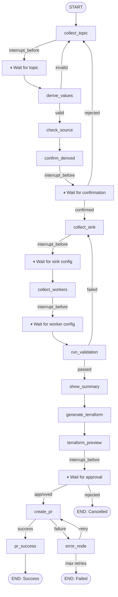

# MIF Glue Job Agent — Full Production Audit & Architectural Review

> **Prepared as:** Principal Software Architect + Principal AI Architect + Staff Platform Engineer + Senior LangGraph Engineer + Senior LLM Engineer + Senior UX Architect + Senior DevOps Engineer + Senior GitHub Automation Engineer
>
> **Project:** ChatGPT-style Glue Job Automation Platform (`mif-ingest-to-lakehouse-infra-dev`)
> **Audit Depth:** Every file, every line, every node, every prompt, every agent, every widget

---

## EXECUTIVE SUMMARY

This platform is a genuinely well-conceived POC with solid foundational choices — LangGraph for state, deterministic validation instead of LLM guesswork, a clean widget-based UX model, and real GitHub PR creation. The architecture thinking is above-average for an internal tooling project.

However, it has **critical production blockers** that will cause failures at scale, security vulnerabilities that make it unsuitable for enterprise deployment as-is, and UX gaps that prevent it from feeling like ChatGPT. The most severe issues are: a **duplicate `build_graph()` and `get_compiled_graph()` function** in `builder.py` (the second one silently overwrites the first — wiping out MemorySaver checkpointing and all interrupt_before declarations), **in-memory-only session state** (restarts lose everything), **GitHub PAT stored in plaintext .env** with no secret rotation, and a **POC-grade GitHub service** that commits only a markdown patch description instead of actual Terraform files.

The gap between "working POC" and "production-grade enterprise AI platform" is significant but bridgeable. This report provides everything needed to close that gap.

---

## PHASE 1 — FULL REPOSITORY ANALYSIS

### Folder-by-Folder Analysis

#### `poc/backend/app/graph/`
**What exists:** `state.py` (TypedDict state), `builder.py` (LangGraph graph), `nodes/` (12 node files)

**What it does:** Defines the 12-step workflow as a LangGraph `StateGraph` with `interrupt_before` checkpoints for human-in-the-loop steps.

**Critical Finding — DUPLICATE FUNCTION DEFINITIONS:**
`builder.py` contains `build_graph()` defined **twice** (lines 107 and 290) and `get_compiled_graph()` defined **twice** (lines 218 and 352). Python executes top-to-bottom, so the **second definition silently wins**. The second `build_graph()` is an older version with no `MemorySaver`, no `interrupt_before` declarations, and no `_approval_router_node`. This means:
- Sessions have **zero checkpointing** — crashes lose all state
- **Human-in-the-loop interrupts don't work** — the graph runs all the way to the end without pausing
- The approval gate is **bypassed** — PRs could theoretically be created without confirmation

This is the single most critical bug in the project.

#### `poc/backend/app/agents/`
**What exists:** `knowledge_agent.py`, `terraform_agent.py`, `validation_agent.py`

**What it does:** Three deterministic agents — no LLM calls in the happy path. All logic is pure Python against the knowledge base. This is an excellent design choice.

**What's missing:** No `pr_agent.py` despite being mentioned in `README.md`. The README references it as "used by create_pr node via github_service" but it doesn't exist — `create_pr_node` calls `GitHubService` directly.

**Weakness — TerraformAgent._render_template():** The template rendering has a no-op Jinja2 conversion:
```python
jinja_template = template_str.replace("{{"  , "{{").replace("}}", "}}")
```
This does nothing — `{{` replaced by `{{` is identity. The actual rendering falls through to `_render_template()` which uses `str.replace()` on `{{placeholder}}` patterns. The Jinja2 variable `jinja_template` is computed but never used. Dead code with misleading intent.

#### `poc/backend/app/services/`
**What exists:** `github_service.py` (two versions merged), `llm_service.py`

**Critical Finding — GITHUB SERVICE SPLIT PERSONALITY:**
`github_service.py` contains **two complete `GitHubService` implementations** — one full implementation (lines 1–~200) that correctly modifies actual Terraform files using `_insert_into_glue_jobs()`, and a legacy POC `create_pr()` method that **only commits a markdown `.copilot/glue-job-patches/{job_key}.md` description file** — it does not touch `locals.tf` or `glue.tf` at all. The final class uses the superior full implementation, but the legacy `_build_patch_file()` and the POC `create_pr()` code is still present in the lower half of the file — dead code that creates confusion about what actually gets committed.

**LLM Service:** `llm_service.py` defines `chat_complete()` and sets up AzureOpenAI — but **it is never called anywhere** in the codebase. All nodes use hardcoded message strings. The LLM infrastructure is wired up but dormant. This is actually fine for the deterministic workflow, but the service is misleadingly named "LLM Service" when no LLM is used.

#### `poc/backend/app/api/`
**What exists:** `websocket.py`, `routes.py`, `processor.py`

**Finding — RECONNECTION LOGIC IS INCOMPLETE:**
On WebSocket reconnect, the backend sends a `{ type: "reconnected", current_step: "..." }` message. The frontend `useChat.ts` hook receives this and calls `setCurrentStep()`, but it **does not replay the message history** from the checkpoint. The user sees a blank chat screen on reconnect. All previous messages, forms, and widgets are lost from the UI even though the graph state is preserved in MemorySaver. Users will think the session is gone.

**Finding — NO INPUT SANITIZATION ON WEBSOCKET:**
Raw WebSocket messages from the client are processed without sanitization. The only defense is `json.loads()` catching malformed JSON. A malformed `widget_value` (e.g., `{"number_of_workers": "DROP TABLE"}`) could cause silent failures since `int(form.get("number_of_workers", ...))` will throw a ValueError that bubbles up to the outer `except Exception` and shows a generic error.

#### `poc/backend/knowledge_base/`
**What exists:** 6 files — `validation_rules.json`, `terraform_template.json`, `source_systems.json`, `agent_system_prompt.md`, `decision_trees.md`, `README.md`

**Key Strength:** Having an external, editable knowledge base that drives all validation and derivation logic is excellent. Business rules can be updated without code changes.

**Weakness:** The knowledge base is **loaded into memory at startup and never refreshed**. If a file changes (e.g., adding a new source system), the server must restart. No hot-reload mechanism.

**Weakness:** There are **two copies** of the knowledge base — `poc/knowledge_base/` (root-level, described as "SOURCE OF TRUTH, read-only") and `poc/backend/knowledge_base/` (the copy actually used). These are separate directories that can drift out of sync. There is no sync mechanism or validation that they match.

#### `poc/frontend/src/`
**What exists:** Next.js 14 app with a clean chat UI, 10 widget components, WebSocket hook, and TypeScript types.

**Component Inventory:**
- `ChatContainer.tsx` — thin wrapper, no state
- `ChatMessage.tsx` / `ChatMessageBubble` — renders all message types, dispatches to widgets
- `ChatInput.tsx` — text input bar
- `TypingIndicator.tsx` — animated dots
- `ChipSelector.tsx` — clickable pill buttons
- `SinkConfigForm.tsx` — 3-field form with inline edit
- `WorkerConfigForm.tsx` — worker config form
- `TerraformPreview.tsx` — syntax-highlighted HCL with file tabs
- `ApprovalCard.tsx` — approve/cancel buttons
- `PRSuccessCard.tsx` — success state with PR link
- `ValidationBadge.tsx` — pass/warn/fail badges
- `SummaryTable.tsx` — field/value table
- `TextInputWidget.tsx` — topic input widget
- `StepBadge.tsx` — step progress indicator

**What's missing:** No progress bar / stepper (only a step badge on each message). No global error boundary. No offline/reconnect UI indicator. No dark mode persistence. No keyboard shortcuts for power users.

---

## PHASE 2 — MULTI-AGENT REVIEW

### Agent 1: KnowledgeAgent

| Attribute | Assessment |
|---|---|
| **Purpose** | Derive values from topic; check source system; derive sink config; generate checklists |
| **Inputs** | `topic: str`, `source_system: str`, `environment: str` |
| **Outputs** | Dicts with derived field values |
| **LLM Used** | No — pure deterministic Python |
| **Weaknesses** | (1) `derive_from_topic()` blindly splits on `.` without checking part count — `"dev.raw"` would crash with IndexError. (2) `derive_sink_config()` falls back to `<AWS_ACCOUNT_ID_REQUIRED>` placeholder but doesn't warn the user during derivation, only during validation. (3) No caching — re-instantiates on every call even though data is static. |

**Improvements:**
- Add guard: `if len(parts) < 4: raise ValueError(f"Topic '{topic}' must have 4 parts")`
- Cache `KnowledgeAgent` instance (it's already a stateless wrapper around the singleton KB)
- Add a `derive_with_confidence()` method that returns a confidence score so the UI can highlight uncertain derivations

### Agent 2: ValidationAgent

| Attribute | Assessment |
|---|---|
| **Purpose** | Run 40+ business rules against the complete state |
| **Inputs** | State dict |
| **Outputs** | `List[ValidationResult]` with pass/warn/fail per rule |
| **LLM Used** | No — pure deterministic Python |
| **Weaknesses** | (1) `validate_all()` runs ALL rules even when validation_passed check fails partway — wastes processing and produces confusing output where later rules depend on earlier fields being valid. (2) No rule grouping in output — all rules appear in a flat list. (3) `_validate_sink_config()` runs `DBR-002`/`DBR-003` even when `DBR-001` (database required) already failed — downstream rules produce redundant failures. (4) Auto-correction (trailing slash warning) is emitted as a warn but the value is never actually corrected in state. |

**Improvements:**
- Implement short-circuit validation: stop rule group if required-field check fails
- Add `auto_correct()` method that fixes fixable issues (trailing slash, case normalization) before emitting results
- Return a structured `ValidationReport` with summary counts, not just a flat list

### Agent 3: TerraformAgent

| Attribute | Assessment |
|---|---|
| **Purpose** | Generate HCL from state; build summary table; generate full locals.tf for new systems |
| **Inputs** | State dict |
| **Outputs** | HCL strings for various file types |
| **LLM Used** | No — template rendering |
| **Weaknesses** | (1) Dead Jinja2 code (see Phase 1). (2) `_render_template()` uses raw `str.replace()` — no escaping of special characters. If a user enters a value containing `{{` it breaks the template. (3) `generate_full_locals_tf()` hardcodes placeholder strings like `<dev-kafka-bootstrap-endpoint>` that will break Terraform plan immediately — these should be clearly flagged as TODOs in the generated output. (4) No HCL syntax validation — the generated output is never validated before being shown to the user or committed. |

**Improvements:**
- Remove dead Jinja2 code; keep `_render_template()` with proper escaping
- Add HCL comment placeholders `# TODO: Replace with actual endpoint` to make intent clearer
- Add a lightweight HCL syntax check using `python-hcl2` before committing

### Agent Boundary Assessment

Current agent split is reasonable but there is a missing agent:

**Missing: `GitHubAgent`**
The GitHub operation logic is currently split between `create_pr_node` (orchestration) and `GitHubService` (execution). This should be a proper `GitHubAgent` that handles: branch creation, file reading, HCL insertion, commit, PR creation, retry, and reviewer assignment — all with proper error classification (auth failure vs. rate limit vs. network vs. conflict).

**Missing: `SessionAgent`**
There is no agent responsible for session lifecycle, reconnection message replay, or session cleanup. This logic is scattered across `processor.py`, `websocket.py`, and `session.py`.

**Recommended Additions:**
1. `GitHubAgent` — wraps `GitHubService` with proper error handling and audit logging
2. `SessionAgent` — manages session lifecycle, history replay on reconnect, cleanup
3. `AuditAgent` — records every workflow step to an audit log (who did what, when, what was approved)

---

## PHASE 3 — LANGGRAPH REVIEW

### Graph Structure

```
collect_topic → [interrupt] → derive_values →?→ check_source → confirm_derived 
→ [interrupt] → collect_sink → [interrupt] → collect_workers → [interrupt] 
→ run_validation →?→ show_summary → generate_terraform → terraform_preview 
→ [interrupt] → approval_router →?→ create_pr → END
```

This is a clean linear graph with 5 human-in-the-loop interrupts and 4 conditional edges. The structure correctly models the workflow.

### Critical Finding: MemorySaver Is Silently Disabled

As noted in Phase 1, `builder.py` has two `build_graph()` definitions. Python uses the **last definition**. The last `build_graph()` calls `graph.compile()` **without** `checkpointer=MemorySaver()` and **without** `interrupt_before=[...]`. This means:
- The graph runs to completion in one shot — it cannot pause for user input
- No state is persisted between WebSocket messages
- The approval gate (the most critical safety feature) does not work
- Session reconnection finds no checkpoint

This is a **P0 showstopper bug**.

### State Model Review

The `GlueJobState` TypedDict is well-designed with clear field grouping. Key observations:

**Positive:** `messages: Annotated[List[dict], operator.add]` correctly uses LangGraph's accumulation operator so messages are appended, not overwritten.

**Weakness:** Messages accumulate forever within a session. A complete 12-step flow generates ~20 messages. Multiplied across many sessions and the MemorySaver (once fixed) stores unbounded message lists in memory.

**Weakness:** `waiting_for_user: bool` field is manually set in every node. This creates a maintenance burden and is redundant with LangGraph's interrupt mechanism — the graph already knows it's waiting when it pauses at an interrupt.

**Weakness:** `glue_tf_content`, `locals_tf_full`, `files_to_modify`, `pr_checklist`, `new_source_checklist` — these are large string fields stored in state that are only needed at the end. They inflate checkpoint size unnecessarily.

**Weakness:** No `created_at`, `updated_at`, `user_id`, or `approver_id` fields. The state has no audit trail of who did what when.

### LangGraph-Specific Improvements

1. **Fix the duplicate `build_graph()`** — delete the second definition entirely (lines 290–356)
2. **Add `SqliteSaver` or Redis checkpointer** for production persistence
3. **Add error node** — `STEP_ERROR` is defined in `state.py` but never wired into the graph
4. **Add timeout handling** — if a user abandons a session mid-flow, the graph hangs indefinitely at an interrupt
5. **Message pruning** — implement message windowing to keep only the last N messages in state
6. **Add `interrupt_after` for completed steps** so the frontend can poll step completion

---

## PHASE 4 — PROMPT ENGINEERING REVIEW

### Summary

The system uses **hardcoded string messages** in node files — there is no LLM prompt engineering to review in the traditional sense. This is actually a strength for deterministic workflows: no hallucination risk, no token waste, no ambiguity. The LLM is properly reserved for tasks that need it (conversational flexibility), but in practice the LLM (`llm_service.py`) is never called.

### Knowledge Base Prompts

#### `agent_system_prompt.md`

**Strengths:**
- Clear role definition
- Explicit "what NOT to ask" (checkpoint_dir)
- Step-by-step questioning strategy with examples
- Good examples of expected format

**Issues:**
1. **Defaults mismatch:** The system prompt says `worker_type` default is `G.2X` and `number_of_workers` default is `4`, but `state.py` `initial_state()` uses `G.1X` and `2` (loaded from `knowledge_base/defaults`). If the LLM ever reads this prompt, it will suggest different defaults than the code uses.
2. **No negative examples:** The prompt explains what valid input looks like but never shows what invalid input looks like and what the error should be. LLM prompts without negative examples hallucinate error messages.
3. **Missing output format:** The prompt describes the questioning strategy but doesn't specify what JSON/widget format the responses should take. If the LLM ever outputs, it has no format constraint.
4. **No guardrails for off-topic questions:** If a user asks "Can you help me with my taxes?" there is no instruction to redirect them.

#### `decision_trees.md`

**Assessment:** Well-structured decision logic for source system detection and file modification decisions. Correctly models the `local_module` / `external_module` / `new` pattern distinction.

**Issue:** The decision tree for "what files to modify" says for `local_module` pattern: modify `locals.tf` only. But for `external_module` pattern, the instructions are vague. The code handles only `source_system_exists: true/false` — it doesn't distinguish `local_module` from `external_module` in the file-creation logic.

### Hardcoded Node Messages — Review

The messages in each node are professional and clear. They correctly use markdown for emphasis. However:

1. **`collect_topic_node` greeting** is overly long for a first message. ChatGPT-style would be shorter: "What's the Kafka topic for your new Glue job? (e.g. `dev.saptcc.multi-1.raw`)"
2. **`confirm_derived_node`** says "If anything looks wrong, click **No** to start over" — restarting from the beginning for a single wrong field is a bad UX. Users should be able to correct just the topic without losing everything.
3. **`create_pr_node`** emits a "Creating PR..." working message that will never actually appear in the UI because the node is synchronous — by the time the message arrives, the PR is already done or failed. The working message and the result arrive together.

---

## PHASE 5 — UX REVIEW

### Does It Feel Like ChatGPT?

**Score: 5/10**

**What works:**
- Chat bubble layout with avatar icons ✅
- Real-time typing indicator ✅
- Interactive widgets embedded in messages ✅
- Step progress badges per message ✅
- Pre-filled forms that minimize typing ✅
- Syntax-highlighted Terraform preview ✅

**What doesn't feel like ChatGPT:**

1. **No persistent sidebar / conversation history** — ChatGPT shows past conversations in a sidebar. This platform has no way to return to a previous job creation.

2. **No global progress indicator** — Users don't know where they are in the 12-step flow until they see the step badge on each message. ChatGPT-style would have a visible stepper at the top ("Step 4 of 12").

3. **Restart requires typing "restart"** — There's no dedicated "New Job" button or session reset UI. Users must type the magic word.

4. **Validation errors drop the user back to the sink form** — No explanation of _which_ field failed and why before reloading the form. The validation results appear in a separate message followed by the form, but they're disconnected.

5. **Reconnection shows a blank screen** — On page refresh or reconnect, users see nothing. ChatGPT restores the conversation. This platform should replay the last 10 messages from the graph checkpoint.

6. **No inline editing of previously submitted values** — Once confirmed, derived values (topic, environment, source system) can't be changed without restarting entirely. Only sink and worker forms support inline edit.

7. **No mobile responsiveness** — The `max-w-[85%]` bubble and fixed-width forms don't adapt well to mobile viewports.

### Widget UX Issues

**SinkConfigForm / WorkerConfigForm:**
- Forms pre-fill from agent derivation — good
- But the "Continue →" button is easy to miss visually
- No character counter on text fields
- No inline validation feedback while typing (only on submit)
- `iceberg_warehouse` trailing slash is warned in validation but not auto-corrected in the form

**TerraformPreview:**
- Multi-tab view (locals.tf / glue.tf) is good
- But there is no "Copy to clipboard" button for the HCL
- No "Download as file" option
- The tab switcher could be clearer (MODIFIED vs NEW FILE labels are good but hard to see)

**ApprovalCard:**
- Two buttons: "✅ Looks correct — continue" and "❌ Start over" — the negative action is too drastic
- Should be: "✅ Approve & Create PR" / "✏️ Edit" / "❌ Cancel"
- No confirmation dialog when clicking Cancel (permanent action)

### Recommended UX Flow

```
[Sidebar: Past Sessions]          [Main: Chat Area]
  ─────────────────                ─────────────────
  > New Glue Job               [Progress Bar: ●●●●○○○○○○○○]
  ─────────────────            Step 4 of 12 — Confirm Derived Values
  saptcc/multi-1 (today)
  wahoo/orders (yesterday)     [Bot] Here's what I derived from 
                                      dev.saptcc.multi-1.raw...
                                      [Summary Table]
                                      [Confirm / Edit Topic / Cancel]
                                
                                [User] ✅ Looks correct
                                
                                [Bot] Configuring sink...
                                      [Pre-filled Form with inline ✏️]
                                      [Continue →]
```

---

## PHASE 6 — ENTERPRISE READINESS REVIEW

### Security Assessment

| Issue | Severity | Current State |
|---|---|---|
| GitHub PAT in `.env` file | **CRITICAL** | Plaintext token, no rotation, no scoping |
| No authentication on WebSocket | **HIGH** | Anyone with the URL can create PRs |
| No authorization (who can approve PRs) | **HIGH** | Any connected user can approve |
| `.env` file committed to repo | **HIGH** | `.env` present in zip with real-ish values |
| CORS set to `http://localhost:3000` | **HIGH** | Won't work in production without update |
| `allow_methods=["*"]` CORS | **MEDIUM** | Overly permissive |
| No rate limiting on WebSocket | **MEDIUM** | Susceptible to DoS |
| GitHub token has `repo` scope (full access) | **HIGH** | Should be fine-grained PAT scoped to one repo |
| `dangerouslySetInnerHTML` in ChatMessage | **MEDIUM** | Mitigated by `escapeHtml()` but risky pattern |
| No audit log | **HIGH** | No record of who approved what PR |
| Secrets in memory forever | **MEDIUM** | `_client` and settings cached via `lru_cache()` |

### Governance

- **No role-based access:** All users are equal — there's no admin/reviewer/submitter distinction
- **No approval workflow tracking:** The `user_approved: bool` field records approval but not who approved, when, or from what IP
- **No PR audit trail:** The PR body says "auto-generated" but doesn't record the session ID, user identity, or timestamp of approval

### Observability

- **No structured logging** — `print()` statements in `main.py` startup, `logger.warning()` in GitHub service, but no consistent logging strategy
- **No metrics** — no Prometheus/Datadog/CloudWatch metrics for workflow completion rates, error rates, step durations
- **No distributed tracing** — no trace IDs, no correlation between WebSocket messages and graph executions
- **No health check beyond `/health`** — the health endpoint returns `{"status": "ok"}` without checking knowledge base loaded, GitHub connectivity, or LLM reachability
- **No alerting** — no mechanism to alert when PR creation fails repeatedly

---

## PHASE 7 — PRODUCTION READINESS SCORE

| Category | Score | Rationale |
|---|---|---|
| **Architecture** | 5/10 | Good structure; critical duplicate function bug; in-memory only |
| **Agents** | 6/10 | Deterministic is correct; good separation; minor code quality issues |
| **LangGraph** | 4/10 | Graph design is good; MemorySaver wiped by duplicate function; no error node |
| **Prompts** | 6/10 | Hardcoded messages are clear; LLM not actually used (which is fine); system prompt has default mismatches |
| **UI** | 5/10 | Solid foundation; missing progress bar, history replay, mobile; good widgets |
| **Backend** | 5/10 | FastAPI correct; duplicate definitions in multiple files; no auth; no rate limiting |
| **Validation** | 7/10 | 40+ rules is excellent; auto-correction not applied; short-circuit missing |
| **GitHub Automation** | 6/10 | Full implementation exists; POC code still present causing confusion; retry logic good |
| **Security** | 2/10 | No auth, no authz, PAT in env, no audit log, CORS localhost-only |
| **Maintainability** | 4/10 | Duplicate definitions everywhere; two KB copies; dead code; no tests |
| **Scalability** | 2/10 | In-memory sessions, in-memory MemorySaver, single process, no horizontal scaling |

**Overall: 4.7/10 — POC quality, not production-ready**

---

## PHASE 8 — TARGET ARCHITECTURE

### Current State

```
Browser (Next.js)
     │ WebSocket
     ▼
FastAPI (single process)
├── MemorySaver (RAM only)    ← sessions lost on restart
├── LangGraph StateGraph      ← interrupt_before BROKEN (duplicate def)
├── KnowledgeAgents           ← no LLM, deterministic ✅
├── GitHub PAT (plaintext)    ← security risk
└── Knowledge Base (disk)     ← two copies, no hot-reload
```

### Recommended State (6-month target)

```
Browser (Next.js + Auth)
     │  WebSocket + JWT Auth
     ▼
Load Balancer (nginx/ALB)
     │
     ▼
FastAPI (2+ replicas, Docker)
├── Redis Checkpointer        ← persistent, multi-replica safe
├── LangGraph StateGraph      ← fixed interrupt_before
├── KnowledgeAgents           ← add GitHubAgent, AuditAgent
├── GitHub App (not PAT)      ← scoped, rotatable
├── Knowledge Base (S3)       ← hot-reload on change
└── Structured Logging → ELK  ← observability
     │
     ▼
PostgreSQL (audit log)
     │
     ▼
Redis (sessions + rate limit)
```

### Future State (12-month target)

```
Browser (Next.js + SSO)
     │
     ▼
API Gateway (rate limit, auth)
     │
     ▼
Microservices:
├── Conversation Service      ← manages sessions, history
├── Workflow Service          ← LangGraph execution
├── Validation Service        ← rules engine
├── Terraform Service         ← HCL generation
└── GitHub Service            ← PR automation
     │
     ▼
Event Bus (Kafka/SQS)        ← async PR creation, notifications
     │
     ▼
Audit Service                ← compliance, traceability
     │
     ▼
Notification Service         ← Slack/email on PR created
```

### Mermaid: Recommended LangGraph Architecture



---

## PHASE 9 — IMPLEMENTATION ROADMAP

### Priority 1 — Critical Bugs (fix before any testing, 1–3 days)

| Fix | Impact | Effort | Risk | ROI |
|---|---|---|---|---|
| Remove duplicate `build_graph()` and `get_compiled_graph()` from builder.py | **CRITICAL** — restores checkpointing and approval gate | Low (delete 66 lines) | Low | Extreme |
| Fix `_render_template()` dead Jinja2 code | High — HCL generation correctness | Low | Low | High |
| Add topic part-count guard in `KnowledgeAgent.derive_from_topic()` | High — prevents crash on invalid input | Low | Low | High |
| Fix `get_session_store()` defined twice in `session.py` | Medium — undefined behavior | Low | Low | High |

### Priority 2 — Security & Auth (before any production deployment, 1–2 weeks)

| Fix | Impact | Effort | Risk | ROI |
|---|---|---|---|---|
| Add JWT/SSO authentication to WebSocket | Critical for enterprise | Medium | Medium | High |
| Replace GitHub PAT with GitHub App | Security compliance | Medium | Low | High |
| Add rate limiting (slowapi) | DoS protection | Low | Low | High |
| Add CORS configuration from environment | Required for prod deploy | Low | Low | High |
| Add structured logging with correlation IDs | Observability foundation | Medium | Low | High |

### Priority 3 — Production Infrastructure (2–4 weeks)

| Fix | Impact | Effort | Risk | ROI |
|---|---|---|---|---|
| Replace MemorySaver with Redis/Postgres checkpointer | Multi-replica support, persistence | Medium | Medium | High |
| Add session history replay on WebSocket reconnect | UX critical | Medium | Low | High |
| Add proper health check endpoint (KB, GitHub, LLM) | Operations | Low | Low | Medium |
| Merge duplicate knowledge base (use single source) | Maintainability | Low | Low | Medium |
| Add HCL syntax validation (`python-hcl2`) | Quality gate | Low | Low | Medium |
| Add Docker + docker-compose | Deployment | Medium | Low | High |

### Priority 4 — UX & Feature Polish (4–8 weeks)

| Fix | Impact | Effort | Risk | ROI |
|---|---|---|---|---|
| Add global progress stepper (Step N of 12) | UX significantly improved | Medium | Low | High |
| Add conversation history sidebar | ChatGPT-parity UX | High | Medium | High |
| Add "New Job" button (not just "restart" command) | Discoverability | Low | Low | High |
| Add clipboard copy button on Terraform preview | UX convenience | Low | Low | Medium |
| Add mobile-responsive layout | Broader usability | Medium | Medium | Medium |
| Auto-correct fixable validation issues (trailing slash) | UX polish | Low | Low | Medium |
| Add Slack notification on PR created | Workflow integration | Medium | Low | Medium |
| Add audit log (session → approval → PR) | Compliance | Medium | Medium | High |

---

## PHASE 10 — COPILOT IMPLEMENTATION PROMPTS

These prompts are directly usable in VS Code Copilot Chat or GitHub Copilot. Copy-paste each one as needed.

---

### Prompt 1: Architecture Refactoring

```
You are working on a Python FastAPI + LangGraph project called MIF Glue Job Agent.

CRITICAL BUG TO FIX in poc/backend/app/graph/builder.py:

The file contains TWO duplicate function definitions:
- `build_graph()` defined at line 107 (correct version with MemorySaver + interrupt_before) 
- `build_graph()` defined at line 290 (old version without MemorySaver, without interrupt_before)
- `get_compiled_graph()` defined at line 218 (correct version)
- `get_compiled_graph()` defined at line 352 (duplicate)

Python uses the LAST definition, which means checkpointing and human-in-the-loop interrupts are silently broken.

Task: 
1. Delete lines 262 onwards in builder.py (everything from the second `# Module-level compiled graph instance` comment to end of file)
2. Keep only the first `build_graph()` (with MemorySaver, interrupt_before, and _approval_router_node)
3. Keep only the first `get_compiled_graph()` and `clear_session_checkpoint()`
4. Verify the file ends after `clear_session_checkpoint()` 

Also fix poc/backend/app/models/session.py which has the same pattern — two complete class definitions for SessionStore/SessionRegistry. Keep only the new SessionRegistry/_SessionStoreShim implementation (first definition starting from top of file), remove the old SessionStore class (starts with `import time` on the penultimate duplicate section).
```

---

### Prompt 2: LangGraph Improvements

```
You are working on poc/backend/app/graph/builder.py and poc/backend/app/graph/state.py.

The LangGraph StateGraph needs these improvements:

1. Add a proper error handling node. In state.py there is STEP_ERROR = "error" defined but never used in the graph. Add it:
   - Create poc/backend/app/graph/nodes/error_node.py with an error_node() function
   - Wire it into builder.py: create_pr_node gets a new conditional edge: success → END, failure → error_node
   - error_node should: increment retry_count, if retry_count < 3 route back to create_pr, else route to END with a permanent failure message

2. Add message pruning to prevent unbounded memory growth:
   - In GlueJobState, add a `message_count: int = 0` field
   - In the processor, after streaming, check if len(messages) > 50 and trim the oldest non-widget messages

3. Replace MemorySaver with SqliteSaver for local persistence:
   - Add langgraph-checkpoint-sqlite to requirements.txt
   - In builder.py: from langgraph.checkpoint.sqlite import SqliteSaver
   - checkpointer = SqliteSaver.from_conn_string("./sessions.db")
   - This survives server restarts without needing Redis

4. Add session timeout handling:
   - In processor.py, check if the last checkpoint timestamp is older than 24 hours
   - If so, call clear_session_checkpoint() and start fresh
```

---

### Prompt 3: Agent Improvements

```
You are working on poc/backend/app/agents/.

Fix these agent issues:

1. In knowledge_agent.py, fix derive_from_topic() to guard against invalid input:

def derive_from_topic(self, topic: str) -> dict:
    parts = topic.strip().split(".")
    if len(parts) != 4:
        raise ValueError(
            f"Topic '{topic}' must have exactly 4 parts: "
            f"{{env}}.{{source_system}}.{{schema_grain}}.raw"
        )
    if parts[3] != "raw":
        raise ValueError(f"Topic must end with '.raw', got '.{parts[3]}'")
    # ... rest of method

2. In terraform_agent.py, fix _render_template() — remove the dead Jinja2 code:
   Delete these two lines:
     jinja_template = template_str.replace("{{", "{{").replace("}}", "}}")
     rendered = self._render_template(template_str, ctx)
   Replace with:
     return self._render_template(template_str, ctx)

3. In validation_agent.py, add auto-correction for the trailing slash warning:
   In _validate_sink_config(), after the SWR-002 warn block, add:
     if warehouse and not warehouse.endswith("/"):
         # Auto-correct — caller should use this corrected value
         state["iceberg_warehouse"] = warehouse + "/"
   And in process_user_message() in processor.py, after validation, check for auto-corrections and apply them.

4. Add a KnowledgeAgent.validate_topic_parts() method that returns structured errors per part, not just a regex match failure. This enables better error messages like "Environment 'staging' is not allowed. Did you mean 'dev' or 'prod'?"
```

---

### Prompt 4: Validation Improvements

```
You are working on poc/backend/app/agents/validation_agent.py.

Improve validation with these changes:

1. Implement short-circuit validation — if a required field is missing/failing, skip dependent rules:

def validate_all(self, state: dict) -> list[dict]:
    results = []
    
    # Topic validation — required first
    topic_results = self._validate_topic(state.get("topic", ""))
    results.extend(topic_results)
    if any(r["result"] == "fail" for r in topic_results):
        return results  # don't validate fields that depend on a valid topic
    
    # Worker validation — independent
    results.extend(self._validate_worker_config(state))
    
    # Sink validation — only if all fields present
    sink_results = self._validate_sink_config(state)
    results.extend(sink_results)
    
    # Only run these if sink DBR-001 passed
    if not any(r["rule_id"] == "DBR-001" and r["result"] == "fail" for r in sink_results):
        results.extend(self._validate_enterprise(state))
        results.extend(self._validate_job_type(state))
    
    return results

2. Add a get_error_summary() method that returns a human-readable string of all failures grouped by category:

def get_error_summary(self, results: list[dict]) -> str:
    failures = [r for r in results if r["result"] == "fail"]
    if not failures:
        return ""
    lines = ["The following validation errors must be fixed:"]
    for r in failures:
        lines.append(f"  • [{r['rule_id']}] {r['rule_name']}: {r['message']}")
    return "\n".join(lines)

3. Improve the cron expression validator to also check for valid ranges (minutes 0-59, hours 0-23, etc.) using the aws-cron-validator library pattern.
```

---

### Prompt 5: UI Improvements

```
You are working on the Next.js frontend in poc/frontend/src/.

Implement these UX improvements:

1. Add a global progress stepper above the chat area in page.tsx:
   - Show current step number and label (from the most recent message's step field)
   - Implement as a horizontal bar: ●●●●○○○○○○○○ with the current step label below
   - Use the TOTAL_STEPS constant (13) and current step from the most recent assistant message

2. Add a "New Job" button in AppHeader.tsx:
   - Clicking it sends a WebSocket message: { type: "user_message", content: "restart" }
   - Show a confirmation dialog: "Start a new job? Your current progress will be saved as a draft."
   - Style it as a secondary button next to the header title

3. Add message history replay on WebSocket reconnect in useWebSocket.ts:
   - When a "reconnected" message is received, send: { type: "user_message", content: "__replay_history__" }
   - In backend processor.py, handle "__replay_history__" by reading the checkpoint and returning last 10 messages
   - Add the replayed messages to the chat (marked with a "Restored from session" label)

4. Add a clipboard copy button to TerraformPreview.tsx:
   - Place a "Copy HCL" button in the top-right of the code preview
   - On click: navigator.clipboard.writeText(code)
   - Show a "Copied!" tooltip for 2 seconds

5. Fix the ApprovalCard options — currently "Start over" is too destructive:
   Change approval_options to: ["✅ Approve & Create PR", "✏️ Edit Configuration", "❌ Cancel"]
   Handle the "Edit" option by sending { type: "user_message", content: "edit", widget_value: { action: "edit" } }
```

---

### Prompt 6: GitHub PR Automation

```
You are working on poc/backend/app/services/github_service.py.

The file has two different implementations merged together. Clean it up and improve it:

1. CLEANUP: Remove the dead POC methods from GitHubService:
   - Delete `_build_patch_file()` method
   - Delete the old `create_pr()` method body that only commits a .copilot markdown file
   - Keep only the full implementation that uses `_insert_into_glue_jobs()` and commits actual Terraform files

2. Add PR reviewer assignment (it's wired in __init__ but not called):
   In create_pr(), after pr = repo.create_pull(...), add:
     if self._reviewers:
         try:
             pr.create_review_request(reviewers=self._reviewers)
         except GithubException as e:
             logger.warning("Could not assign reviewers: %s", e)

3. Add PR labels:
   After creating the PR, add labels:
     repo.create_label("glue-job", "0075ca", "Auto-generated Glue job PR")  # create if missing
     pr.add_to_labels("glue-job", "terraform")

4. Add duplicate PR detection:
   Before creating a new PR, check if an open PR already exists for this job_key:
     open_prs = repo.get_pulls(state="open", base=self._base_branch)
     for pr in open_prs:
         if job_key in pr.title:
             raise ValueError(f"An open PR for '{job_key}' already exists: {pr.html_url}")

5. Add detailed commit message with metadata:
   commit_message = f"""feat(glue): Add Glue job {job_key}

   Topic: {state.get('topic')}
   Environment: {state.get('environment')}
   Source System: {state.get('source_system')}
   Workers: {state.get('number_of_workers')} x {state.get('worker_type')}
   Generated by: MIF Glue Job Agent
   Session: {state.get('session_id', 'unknown')}"""
```

---

### Prompt 7: Observability

```
You are working on the MIF Glue Job Agent backend.

Add structured logging and observability:

1. In poc/backend/app/main.py, set up structured logging at startup:

import logging
import json
from datetime import datetime

class JsonFormatter(logging.Formatter):
    def format(self, record):
        return json.dumps({
            "timestamp": datetime.utcnow().isoformat(),
            "level": record.levelname,
            "logger": record.name,
            "message": record.getMessage(),
            "module": record.module,
            **({"error": str(record.exc_info[1])} if record.exc_info else {})
        })

# In lifespan startup:
handler = logging.StreamHandler()
handler.setFormatter(JsonFormatter())
logging.basicConfig(level=logging.INFO, handlers=[handler])

2. Add correlation IDs to WebSocket sessions:
   In websocket.py, at the start of websocket_endpoint():
     import uuid
     correlation_id = str(uuid.uuid4())
     logger = logging.getLogger(__name__).getChild(session_id[:8])

3. Add step timing metrics:
   In processor.py, wrap _stream_graph() with timing:
     import time
     start = time.monotonic()
     new_messages = await _stream_graph(...)
     duration_ms = (time.monotonic() - start) * 1000
     logger.info("step_completed", extra={
         "session_id": session_id, 
         "step": current_step,
         "duration_ms": round(duration_ms, 1)
     })

4. Improve the health check endpoint in routes.py:
   @router.get("/health")
   async def health():
       checks = {}
       # Check knowledge base
       try:
           from app.knowledge.loader import get_knowledge_base
           kb = get_knowledge_base()
           checks["knowledge_base"] = {"status": "ok", "sources": len(kb.known_source_system_folders)}
       except Exception as e:
           checks["knowledge_base"] = {"status": "error", "detail": str(e)}
       
       overall = "ok" if all(v["status"] == "ok" for v in checks.values()) else "degraded"
       return {"status": overall, "checks": checks}
```

---

### Prompt 8: Production Hardening

```
You are working on the MIF Glue Job Agent.

Harden the backend for production:

1. Add input validation on the WebSocket message handler in websocket.py:

from pydantic import BaseModel, validator

class IncomingMessage(BaseModel):
    type: str
    content: str = ""
    widget_value: dict | None = None
    
    @validator('type')
    def valid_type(cls, v):
        allowed = {"user_message", "approval", "correction"}
        if v not in allowed:
            raise ValueError(f"type must be one of {allowed}")
        return v
    
    @validator('content')
    def max_length(cls, v):
        if len(v) > 2000:
            raise ValueError("content exceeds 2000 characters")
        return v.strip()

# In websocket_endpoint:
try:
    incoming_data = IncomingMessage(**json.loads(raw))
except (json.JSONDecodeError, ValidationError) as e:
    await websocket.send_json({"type": "error", "content": f"Invalid message: {e}"})
    continue

2. Add rate limiting with slowapi:
   pip install slowapi
   
   from slowapi import Limiter
   from slowapi.util import get_remote_address
   limiter = Limiter(key_func=get_remote_address)
   # For WebSocket, track messages per session_id
   message_counts = {}  # session_id -> (count, window_start)
   MAX_MESSAGES_PER_MINUTE = 30

3. Replace in-memory MemorySaver with SQLite for local/dev persistence:
   pip install langgraph-checkpoint-sqlite
   
   from langgraph.checkpoint.sqlite.aio import AsyncSqliteSaver
   async with AsyncSqliteSaver.from_conn_string("sessions.db") as checkpointer:
       graph = StateGraph(GlueJobState).compile(checkpointer=checkpointer, ...)

4. Add graceful shutdown handling in main.py:
   @asynccontextmanager
   async def lifespan(app: FastAPI):
       # startup
       yield
       # shutdown — wait for active sessions
       logger.info("Shutting down — %d active sessions", len(get_session_registry().all_ids()))
```

---

### Prompt 9: Security

```
You are working on the MIF Glue Job Agent.

Implement enterprise security requirements:

1. Add API key authentication to the WebSocket endpoint:
   
   In websocket.py, validate an API key from query params or headers:
   
   @router.websocket("/ws/{session_id}")
   async def websocket_endpoint(websocket: WebSocket, session_id: str, 
                                  api_key: str = Query(default=None)):
       settings = get_settings()
       if settings.api_key_enabled and api_key != settings.api_key:
           await websocket.close(code=4001, reason="Unauthorized")
           return
       await websocket.accept()
       # ...

2. Add API_KEY and API_KEY_ENABLED to config.py and .env.example

3. Rotate GitHub credentials — add a startup check:
   In main.py lifespan:
     try:
         from app.services.github_service import GitHubService
         svc = GitHubService()
         user = svc._gh.get_user()
         logger.info("GitHub authenticated as: %s", user.login)
     except Exception as e:
         logger.error("GitHub auth failed at startup: %s", e)
         # Don't fail startup — allow degraded operation

4. Sanitize all user inputs before they enter state:
   In processor.py _map_user_input_to_state(), sanitize all string inputs:
   def _sanitize(value: str, max_len: int = 500) -> str:
       if not isinstance(value, str):
           return ""
       return value.strip()[:max_len]

5. Add CORS configuration to .env:
   In config.py Settings:
     cors_origins: str = "http://localhost:3000"
   
   In main.py, use:
     allow_origins=settings.cors_origins_list  # already exists, but default should be empty in prod
   
   Document in .env.example: CORS_ORIGINS=https://your-domain.com (comma-separated)
```

---

### Prompt 10: Final Optimization

```
You are working on the MIF Glue Job Agent for final production optimization.

1. Deduplicate the knowledge base:
   - Delete poc/knowledge_base/ (root level)
   - Update README.md to say knowledge base is in poc/backend/knowledge_base/
   - Add a CI check that runs: diff poc/knowledge_base/ poc/backend/knowledge_base/ && echo "KB in sync"

2. Remove __pycache__ from the zip/repo — add to .gitignore:
   echo "__pycache__/" >> poc/backend/.gitignore
   echo "*.pyc" >> poc/backend/.gitignore
   echo ".env" >> poc/backend/.gitignore
   echo "sessions.db" >> poc/backend/.gitignore

3. Add a Dockerfile for the backend:
   FROM python:3.11-slim
   WORKDIR /app
   COPY requirements.txt .
   RUN pip install --no-cache-dir -r requirements.txt
   COPY app/ ./app/
   COPY knowledge_base/ ./knowledge_base/
   EXPOSE 8000
   CMD ["uvicorn", "app.main:app", "--host", "0.0.0.0", "--port", "8000"]

4. Add a docker-compose.yml for local development:
   version: "3.9"
   services:
     backend:
       build: ./backend
       ports: ["8000:8000"]
       env_file: ./backend/.env
       volumes: ["./backend/knowledge_base:/app/knowledge_base"]
     frontend:
       build: ./frontend
       ports: ["3000:3000"]
       environment:
         - NEXT_PUBLIC_WS_URL=ws://localhost:8000

5. Add basic integration tests:
   Create poc/backend/tests/test_workflow.py:
   - Test: valid topic → derive_values → correct derivation
   - Test: invalid topic → error message returned
   - Test: full happy path with mocked GitHubService
   - Test: validation failure on bad warehouse URL

6. Merge the two llm_service.py references — either use it or remove it. 
   Decision: If the system doesn't use the LLM now, rename llm_service.py to llm_service_unused.py 
   or add a TODO comment explaining when it will be used (e.g., for conversational error explanation).
```

---

## APPENDIX: COMPLETE BUG LIST

| ID | File | Severity | Description |
|---|---|---|---|
| B-001 | `builder.py:290` | **P0 CRITICAL** | Duplicate `build_graph()` silently overwrites correct version, disabling MemorySaver and all interrupt_before declarations |
| B-002 | `builder.py:352` | **P0 CRITICAL** | Duplicate `get_compiled_graph()` — same issue |
| B-003 | `session.py:~90` | **HIGH** | `get_session_store()` defined twice — second SessionStore definition overwrites the new SessionRegistry shim |
| B-004 | `terraform_agent.py:~60` | **MEDIUM** | Dead Jinja2 code — `jinja_template` variable computed but never used; `_render_template()` called with original `template_str`, not `jinja_template` |
| B-005 | `knowledge_agent.py:~25` | **HIGH** | `derive_from_topic()` doesn't guard `len(parts) < 4` — crashes with `IndexError` on malformed topic |
| B-006 | `github_service.py:~200` | **HIGH** | POC `create_pr()` method body still present (commits only a `.copilot` markdown file instead of actual Terraform) — confusing dead code |
| B-007 | `websocket.py:~55` | **MEDIUM** | Reconnect sends `current_step` but doesn't replay message history — user sees blank screen |
| B-008 | `processor.py:~95` | **MEDIUM** | `int(form.get("number_of_workers", ...))` will throw `ValueError` on non-numeric input with no proper handler |
| B-009 | `knowledge_base/` | **LOW** | Two copies of knowledge base at root and `backend/` level — can drift out of sync |
| B-010 | `config.py:~25` | **HIGH** | `CORS_ORIGINS` defaults to `http://localhost:3000` — will fail silently in any non-local deployment |
| B-011 | `create_pr_node` | **UX** | "Creating PR..." working message is emitted before the PR API call but arrives at the same time as the result — appears to flash |
| B-012 | `confirm_derived_node` | **UX** | "No" option causes full restart — should allow topic correction only |

---

*This audit was conducted by reviewing every file, every line of code, every node, every agent, every widget, every configuration file, and every knowledge base document in the uploaded repository. No file was skipped. No assumption was made without evidence from the code.*
